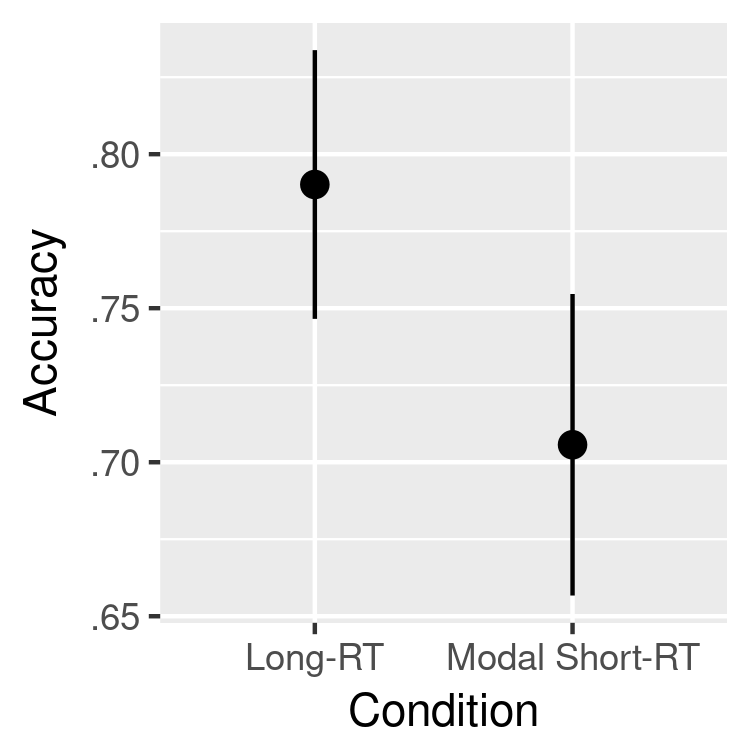
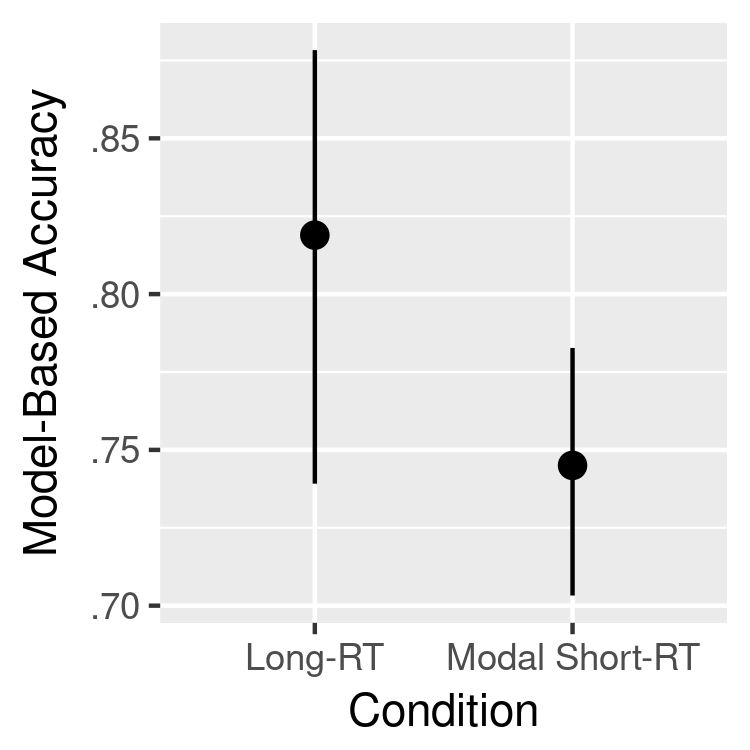

Memory Sampling May be Sequentially Dependent
===

Hypothesis
---

A majority vote of three short judgments tends to be more accurate than one
long judgment.

Method
---

**Participant**

Three hundred participants (149 females and 151 males) were recruited through
Amazon Mechanical Turk (`https://www.mturk.com`). Their age ranges from 19 to
70, with its median 37. Each participant was paid $3.00 for completing the
task.

**Apparatus**

The stimuli were horizontal lines of various lengths. The training phase
repeatedly presented six stimuli: length of 0.1, 0.2, 0.3, 0.7, 0.8, and 0.9.
These lengths correspond to the probability that a line fits into one category.
The line length of 0.1, for example, has .1 probability that the line fits into
one of the two categories.

For each participant, a category was randomly assigned into Label "F" or "J",
and the line lengths were converted into pixels by multiplying it by 400 and
adding an offset. The offset for each participant was a uniformly selected
random number from 30 to 100.

The test phases use different 10 stimuli with lengths of 0.05, 0.15, 0.25,
0.35, 0.45, 0.55, 0.65, 0.75, 0.85, and 0.95. These line length was converted
into pixels with the same procedure as above.  The same offset was used between
the training and test phases for each participant.

**Procedure**

Participants learned to categorize the six training stimuli through corrective
feedback. During the training phase, on every trial, participants were
instructed to fixate on a small cross appearing in a random position on the
screen. After 1000ms, a line stimulus replaced the cross at the same position.
Participants were then to indicate their category decision by pressing a key
("F" or "J"). Once the participant responded, a feedback message ("Correct" or
"Wrong") was displayed right beside the stimulus. The feedback was displayed
for 1000ms. The screen coordinates, where a fixation cross and a stimulus
appear, were randomized on each trial to prevent participants from using marks
or smudges on the screen as an aid.

The training phase presented participants each of six training stimuli 10 times
in a random order.  Frequency of category labels is proportional to the
probability of category for each stimulus. A stimulus with .1 probability of
fitting into Category F is, for example, presented once as Category F and nine
times as Category J.

From the 10th trial till the end of the training phase, a running accuracy was
displayed at the top of screen. This running accuracy was the accuracy of the
last 10 trials, and updated after every response participant made.

After completing the 60 training trials, participants completed the two test
phases: short-rt and long-rt. During these test phases, corrective feedback was
not provided, and the first six trials in each phase presented the same six
stimuli from the training phase as practice trials.  The order of the two test
phases was counter-balanced between participants.

During the short-rt test phase, a stimulus was initially presented as a black
solid line, gradually turned grey and became completely white in 500ms,
disappearing from the screen.  Participants were instructed to respond before a
stimulus disappears. If participant missed this response time period, the same
stimulus is presented later.  The short-rt test phase was completed when
participants responded each of the 10 testing stimuli 3 times.

During the long-rt test phase, a stimulus was initially presented as a grey
solid line, and turned black after 1500ms. Participants were instructed to
respond after a stimulus turns black. If participant responded before a
stimulus turned black, the same stimulus is presented later. The long-rt test
phase was completed when participants responded to each of 10 testing stimuli
once.

Results
---

First, I looked at the proportions of correct judgements for each participant
for each response-time condition. Their means along with the 95% confidence
intervals are summarised below.

Then I fit mixed-effect logistic regressions to predict accuracy of judgements.
These regression models allow the effect of response-time and baseline accuracy
to vary between participants and also between stimulus lengths. The model fit
indicates a long judgement is significantly more likely to be accurate than a
majority vote of three short judgements: χ²(1)=10.36, p=.001. Estimates from
the mixed-effect regressions are summarised below.

Overall, the results show the opposite pattern to the hypothesis: a long
judgement is more accurate than a majority vote of short judgements.
